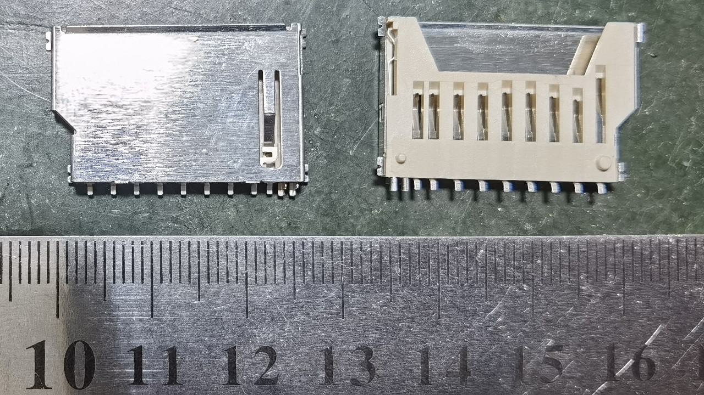
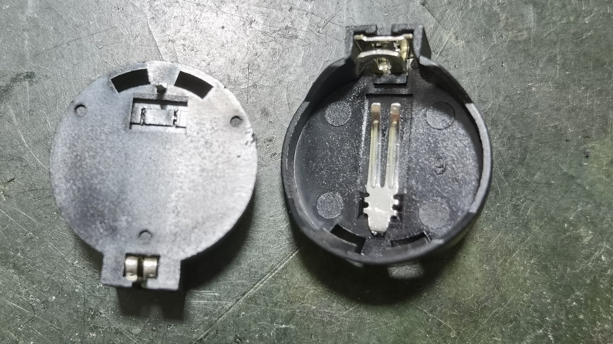
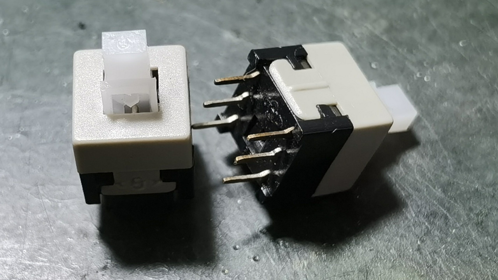
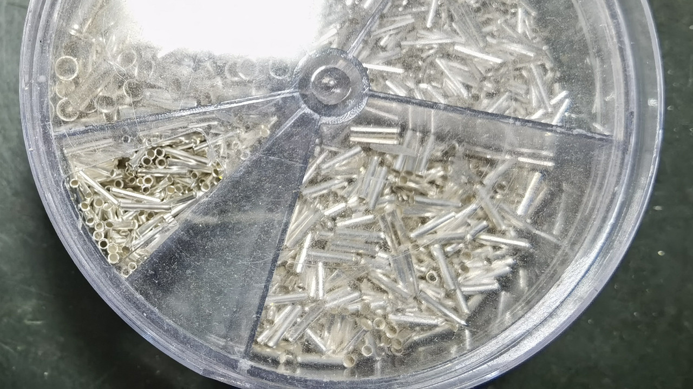
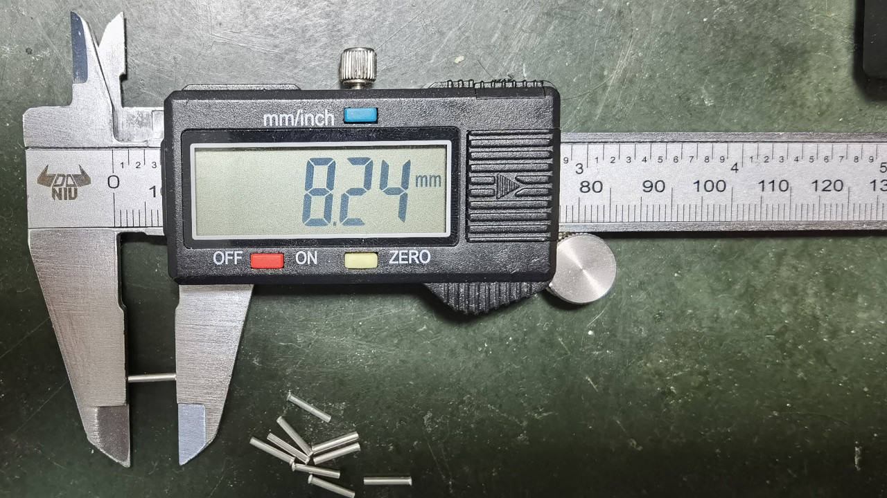
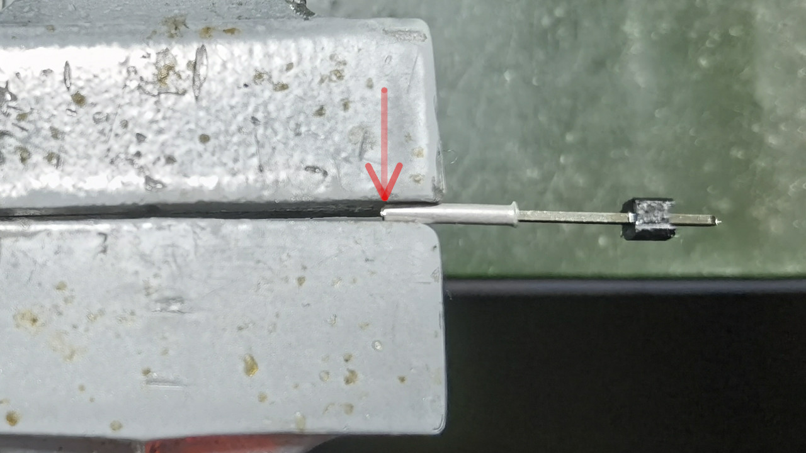
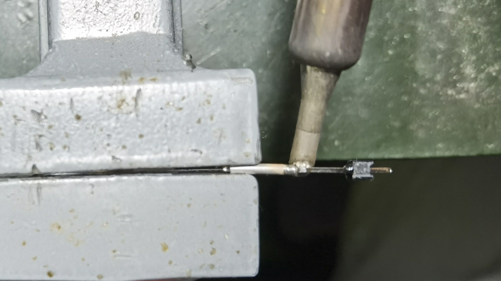
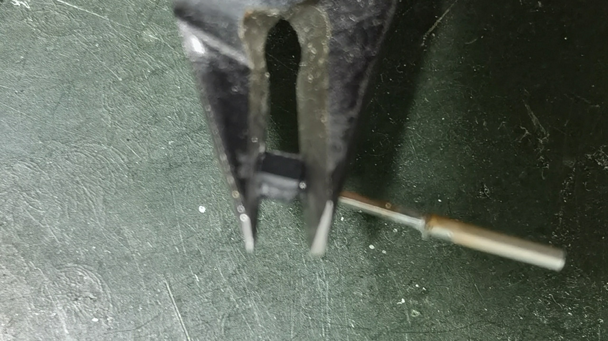

Building the ACSI2STM PCB
=========================

You can find the PCB and its sources in the pcb directory.

The PCB is built using EasyEDA. Source JSON files for EasyEDA are provided.

A Gerber package is provided. It was generated straight from EasyEDA so it
should be standard enough to be used as-is by any widespread manufacturer.

For people wanting to etch the PCB themselves, etching masks are provided in
PDF format.

The schematic is provided as a PDF and photo views as SVG if you don't want to
or cannot use EasyEDA.

Powering the PCB
================

**Warning**: Do not use the onboard USB socket of the STM32. USB data lines are
connected to the hard drive port, this **will** break things.

There are 3 options to power the board:

* Power via a 5V DC jack. Solder a DC jack in DC1 and use any standard 5V power
  adapter.
* Power via a floppy power plug. Solder 2.54mm header pins in J1 and use a
  floppy power cable. If you have an external floppy, chances are you already
  have a Y cable. Be careful to insert it the right way.
* Power via the USB serial converter. Put a jumper on J4 to use that solution.

PCB Features and options
========================

Some parts are optional and some jumpers require soldering depending on what you
want or need to do.

SD card slots
-------------

There are 4 SD card slots. Only the first one is mandatory, others can be
enabled or disabled with solder blobs (JP switches).

JP1 joins the SD lock switch sensor for the first SD card reader on its left.
Put a solder blob on it to enable SD lock switch. If omitted, the SD card will
always be read-only if ACSI_SD_WRITE_LOCK is set to 2 or read-write if
ACSI_SD_WRITE_LOCK is set to 1 or 0.

JP2 to JP4 configure slots 2 to 4, respectively. If set in the top position,
the slot is completely disabled. This way, you can build a PCB with less SD
slots. The bottom position serves the same purpose as JP1.

**Warning**:Never solder the 3 pads of a same JP element together, this will
create a short.

Using a premade MicroSD reader instead of SD slots
--------------------------------------------------

If soldering SMD parts is a problem, you can fit a premade MicroSD reader PCB.
Fit the PCB in the top-left corner and solder on the 6 GND...CS pins.

If you use this solution, you can use only 1 slot. Omit C4, C5 and R1.

RTC battery
-----------

You can put a CR2032 battery holder to save date and time.

The battery holder covers one floppy connector pin, so you will have to solder
floppy pins before the battery holder.

The C3 capacitor keeps power on while changing the battery. This is optional.

USB to TTL USART
----------------

To make firmware upgrades and serial output simple, a header matching many USB
to serial adapters was added. It is made for these models that have a jumper to
select 5V or 3V3. 3V3 is strapped to VCC and 5V is left unconnected.

You can power the whole board using this kind of adapter by connecting J4. You
can put a jumper on J4 to enable this temporarily.

**Warning**: When powering the board using the adapter, make sure not to power
it with any other method, power supplies may conflict and this could destroy
hardware.

PC floppy adapter
-----------------

Since the floppy port would be covered by the adapter anyway, the PCB relays the
floppy disk pins to a standard 34-pin PC floppy connector.

To build pins that will reach the floppy connector, see the dedicated section
below.

### FD density selection (J3)

The J3 connector allows putting a jumper to the pin 2 of the floppy drive. This
pin is used by some drives to select HD or DD floppy compatibility mode. Some
other drives have an output to tell what kind of floppy is actually inserted,
in that case you don't need any jumper.

If you don't know what to do, put a jumper in the DD position.

### Drive A selector (S1)

This switch is used to enable drive A.
You can use a switch, a jumper or directly solder a small wire.

**Warning**: To use A drive, you need to disconnect the internal floppy drive if
your ST is equipped with one.

In top position, both floppy drives will be connected to the cable. In bottom
position, only drive B will be connected to the ribbon cable.

Omit S1 if unsure.

### Drive swap switch (S2)

Use S2 to indicate which kind of ribbon cable you use: twisted if you connect
the top row, straight if you connect the bottom row.

If you connect 2 floppies to the ribbon cable (with a twisted cable or by
setting drive jumpers), this switch will swap the 2 drives.

If unsure, connect in twisted mode.

Building floppy connector pins
==============================

The floppy connector requires very long pins. If you want to use the floppy
connector adapter, you will need to build 14 special pins.

The pins must be at least 20mm long to correctly reach the connector from the
PCB.

You will need
-------------

### 1.24mm-1.28mm diameter hollow round pins

### 21mm long 2.54 standard square wrapping pins.

Building the pin
----------------

* Insert the round pin in a vice.
* Insert the square pin inside the round pin.
* Make sure the square pin goes through the whole length of the round pin.

* Solder the 2 pins together on the top part. Don't leave excess solder.
  Make sure that pin alignment is still correct after soldering.

* Cut the plastic part of the square pin. If a small bit of plastic remains it's
  not a problem.

